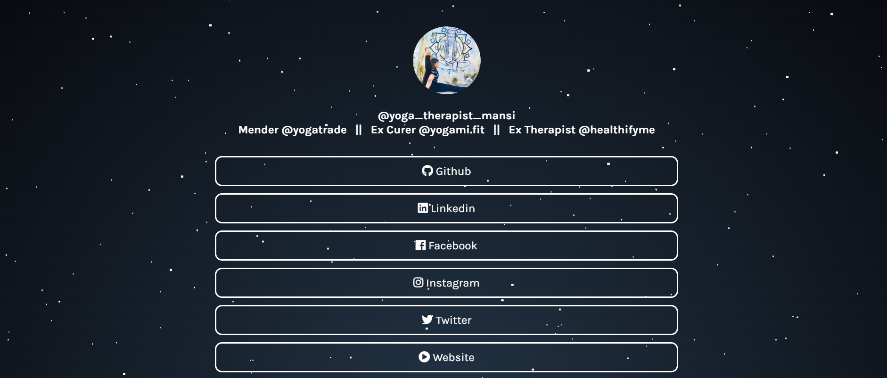

<h1 align="center">🌲 Soul-Heal v2.0</h1>
<h3 align="center">Web Page of Mansi Dwivedi, The site consists a medium to start doing yoga ,meditations and techniques that would help you align yourself. More info insde.</h3>

  
  
  
  
  

  <a href="#-about-the-project">About the project</a>&nbsp;&nbsp;&nbsp;|&nbsp;&nbsp;&nbsp;
  <a href="#-getting-started">Getting started</a>&nbsp;&nbsp;&nbsp;|&nbsp;&nbsp;&nbsp;
  <a href="#-license">License</a>

---

  

---

## 💡 About the project

This is an open source project.

## 🚀 Getting started

The services consists a series of yoga ,meditations and techniques that would help you align yourself. Easy breathing techniques to balance out your energies. You would experience changes in yourself and changes in your lifestyle. Remember the Divine power is always around us. The only thing we need to work on is purifying ourselves to tap into that power.

## 🤔 How to contribute

Join the Class.

## 📝 License

This project is under the MIT license. See the [LICENSE](LICENSE.md) file for more details.

---

Made with ❤️ by Sanskar Dwivedi :wave: [Get in touch](https://github.com/sanskar1812)
 